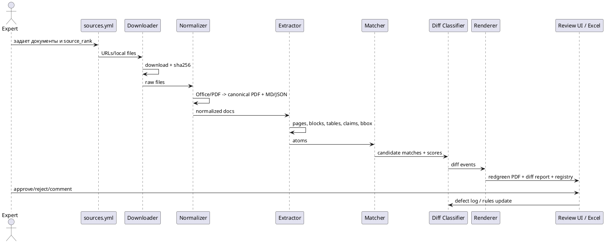

**ROLE**

Отвечаю как архитектор document-intelligence / legal-tech пайплайнов: сверка НПА, презентаций, таблиц, PDF/DOCX/PPTX, доказуемые diff-отчеты, контроль источников, human-in-the-loop. То есть ровно та скучная зона, где «ИИ сравнил» обычно означает «Excel плачет в углу».

**PROMPT**

Нужно не просто найти «open-source проект для сравнения документов», а собрать воспроизводимый контур сверки для пакета: концепции миграционной политики 2026–2030 и 2019–2025, 109-ФЗ, планы реализации, презентация ВЦИОМ, подборки Минэка/Клерка и прочая нормативка. На выходе: постраничный red/green PDF, отдельный diff-документ, реестр расхождений в Excel/CSV, проверяемые ссылки на источники и понятная методика, чтобы внутренний «Нейрон» перестал быть единственным оракулом с настроением кофемашины.

---

## TL;DR

**Да, open-source есть, но одного проекта “сравнить всё” нормально не хватит.** Нужно собирать пайплайн из 5 слоев:

1. **Нормализация файлов**: DOCX/PPTX/XLSX/PDF → canonical PDF + markdown/text/json.
2. **Извлечение блоков**: страницы, слайды, абзацы, таблицы, bbox-координаты.
3. **Сопоставление**: exact/fuzzy/semantic matching, но по релевантным парам, не «все со всем».
4. **Diff**: красное = удалено/противоречит, зеленое = добавлено/подтверждает, желтое = частично/нужен эксперт.
5. **Отчетность**: `pagewise_redgreen.pdf`, `diff_report.html/docx`, `diff_index.xlsx`, `evidence_snippets/`.

Внутренний сервис из памятки использует VLM для презентаций, OCR для текстовых файлов, поддерживает `pdf/doc/docx/pptx`, сравнивает «все пары», выдает Excel и просит анализировать статусы «противоречит» и «частично» вручную. Там же указано, что обработка одного файла занимает около 30 минут, а сравнение около 2 часов. То есть сервис уже сам подмигивает: «я не финальный арбитр, я генератор черновиков, пожалуйста, не судите меня строго». 

---

# 1. Что именно нужно сравнивать, а что валидировать

Главная ошибка: **сравнение презентации с законом как “два текста” почти бессмысленно**. Это разные жанры: презентация формулирует тезисы, закон задает нормы, концепция задает политику, план реализации задает мероприятия. Поэтому нужен **граф сравнения**, а не тупой режим «все пары», потому что «все пары» рождает красивые ложные противоречия, ну зато Excel выглядит занятым.

```text
                         [Концепция 2026–2030]
                          /       |        \
                         /        |         \
          [Концепция 2019–2025] [План 2026–2030] [109-ФЗ]
                  |                |             |
                  |                |             |
           [План 2024–2025]   [Минэк]       [Клерк/подборки]
                  \                |             /
                   \               |            /
                    -------- [Презентация ВЦИОМ] --------
```

## Правильные типы сверки

| Пара                                       |                Тип сверки | Что ищем                                                         |
| ------------------------------------------ | ------------------------: | ---------------------------------------------------------------- |
| Концепция 2026–2030 vs Концепция 2019–2025 |   **semantic/legal diff** | новые цели, исчезнувшие задачи, ужесточение, смена акцентов      |
| Концепция 2026–2030 vs План 2026–2030      |         **coverage diff** | все ли задачи Концепции покрыты мероприятиями                    |
| Концепция 2019–2025 vs План 2024–2025      |   **implementation diff** | что было запланировано под старую Концепцию                      |
| 109-ФЗ vs Концепции/планы                  | **normative consistency** | какие идеи имеют правовую основу, где только стратегия           |
| Минэк/Клерк vs НПА                         |     **source validation** | корректно ли пересказаны нормы                                   |
| ВЦИОМ vs НПА/Концепции                     |      **claim validation** | подтверждаются ли тезисы про миграцию, интеграцию, регулирование |

В презентации ВЦИОМ есть миграционные тезисы: на слайдах про мировые тренды указано усиление регулирования миграции, на российском слайде — ужесточение миграционной политики, госзаказ, стимулирование интеллектуальной и образовательной миграции, а в блоке вызовов — слабая интеграция трудовых мигрантов и риск межнациональной напряженности. Это надо **валидировать по Концепции/НПА**, а не искать буквальное совпадение фраз. 

---

# 2. Источники истины для вашего пакета

Для НПА надо фиксировать **иерархию источников**, иначе система будет сравнивать официальный указ, блог и PDF с регионального сайта как равных родственников, что, конечно, очень демократично, но юридически бесполезно.

| Документ                    | Приоритет | Комментарий                                                                                                                                                                                                                                                                             |
| --------------------------- | --------: | --------------------------------------------------------------------------------------------------------------------------------------------------------------------------------------------------------------------------------------------------------------------------------------- |
| Концепция 2026–2030         |         1 | Указ Президента РФ от 15.10.2025 № 738 опубликован на сайте Кремля; также есть официальное опубликование на pravo.gov.ru. ([Kremlin][1])                                                                                                                                                |
| Концепция 2019–2025         |         1 | Указ Президента РФ от 31.10.2018 № 622 опубликован на сайте Кремля и на pravo.gov.ru. Но важно учитывать редакцию: в 2023 году в Концепцию вносились изменения, поэтому старый PDF 2018 года может быть не финальной редакцией. ([Kremlin][2])                                          |
| 109-ФЗ о миграционном учете |       1–2 | Официальный/первичный слой: pravo.gov.ru и Кремль для исходного закона; для консолидированной редакции удобны Consultant/Контур/Гарант. ([Pravo.gov.ru][3])                                                                                                                             |
| План реализации 2024–2025   |         1 | Распоряжение Правительства РФ от 16.01.2024 № 30-р есть на government.ru и pravo.gov.ru. ([Government of the Russian Federation][4])                                                                                                                                                    |
| План реализации 2026–2030   |       1–2 | Его стоит добавить в пакет: распоряжение Правительства РФ от 30.12.2025 № 4171-р утверждает план мероприятий по реализации Концепции 2026–2030. Иначе новая Концепция сравнивается без своего плана реализации, что примерно как проверять двигатель без машины. ([Consultant Plus][5]) |
| Минэк                       |         2 | Страница Минэкономразвития по миграционной политике полезна как ведомственная подборка/информационный слой. ([MinEconomy Russia][6])                                                                                                                                                    |
| Клерк                       |         3 | Это вторичный обзор по иностранным работникам и изменениям 2025 года; использовать можно, но только как digest, не как источник юридической истины. ([Клерк][7])                                                                                                                        |
| ВЦИОМ                       |         3 | Презентация — источник тезисов и аналитики, но не НПА. Проверять через claim validation.                                                                                                                                                                                                |

---

# 3. Почему текущий «Нейрон» дает мусорные/слабые результаты

По присланной памятке сервис устроен как типовой **extract → compare → Excel**. Это нормально для черновика, но плохо для юридически аккуратной сверки. 

## Основные причины

| Проблема                            | Как проявляется                                                        | Как лечить                                     |
| ----------------------------------- | ---------------------------------------------------------------------- | ---------------------------------------------- |
| **“Все пары”**                      | сравниваются нерелевантные документы, получаются ложные «противоречит» | строить граф пар сравнения                     |
| **OCR/VLM без source hierarchy**    | фраза из презентации и норма закона получают одинаковый вес            | вводить приоритет источников                   |
| **Нет атомизации**                  | система сравнивает большие куски текста                                | разбивать на `page → block → claim → citation` |
| **Нет координат доказательств**     | непонятно, где именно отличие                                          | хранить bbox: страница, координаты, фрагмент   |
| **Слабая юридическая нормализация** | «иностранный гражданин», «ИГ», «ЛБГ» считаются разными сущностями      | словарь терминов и canonicalization            |
| **Нет режима “coverage”**           | план реализации не проверяется на покрытие задач Концепции             | отдельный тип проверки: задача → мероприятие   |
| **Нет реестра ошибок модели**       | ошибки удаляются, но не превращаются в правила                         | вести defect log и regression tests            |

---

# 4. Рекомендуемый open-source стек

Одной кнопки нет. Нужна сборка. Прекрасно, человечество изобрело 200 инструментов, но ни один не делает всю работу, потому что страдать должны все.

| Слой                                                     | Инструменты                                       | Зачем                                                                                                                                                                                                                                                                                               |
| -------------------------------------------------------- | ------------------------------------------------- | --------------------------------------------------------------------------------------------------------------------------------------------------------------------------------------------------------------------------------------------------------------------------------------------------- |
| **Форензик-сравнение файлов**                            | `diffoscope`                                      | Глубокое сравнение файлов/архивов/PDF, полезно для диагностики, но не заменяет semantic diff. ([diffoscope.org][8])                                                                                                                                                                                 |
| **Конвертация DOCX/PPTX/XLSX/PDF → текст/markdown/json** | `MarkItDown`, `Docling`, `Unstructured`, `Pandoc` | MarkItDown поддерживает PDF, PowerPoint, Word, Excel, HTML, CSV/JSON/XML и др.; Docling умеет конвертировать PDF/DOCX/PPTX/images/HTML/Markdown; Unstructured дает open-source компоненты для PDF/HTML/Word и других документов; Pandoc полезен для markdown/html/docx/pdf-конверсий. ([GitHub][9]) |
| **Office → PDF для pagewise render**                     | LibreOffice headless                              | Нужен для получения стабильной “картинки страницы/слайда”; у LibreOffice есть PDF export command-line параметры. ([help.libreoffice.org][10])                                                                                                                                                       |
| **PDF extraction / annotations**                         | `PyMuPDF`, `pdfplumber`                           | PyMuPDF умеет извлекать текст, работать с таблицами и добавлять PDF-аннотации; pdfplumber извлекает символы, линии, прямоугольники, таблицы и полезен для визуальной отладки. ([pymupdf.readthedocs.io][11])                                                                                        |
| **Fuzzy matching**                                       | `RapidFuzz`                                       | Быстрое сопоставление похожих строк/абзацев, хорошо для разных формулировок. ([RapidFuzz][12])                                                                                                                                                                                                      |
| **Text diff / redlines**                                 | `redlines`, `Python-Redlines`, `difflib`          | redlines дает Markdown/HTML/JSON diff со вставками/удалениями; Python-Redlines закрывает нишу DOCX redline/track changes. ([GitHub][13])                                                                                                                                                            |
| **Табличный diff**                                       | `daff`, `xlsx2csv`                                | daff сравнивает таблицы и формирует summary/patch; xlsx2csv конвертирует XLSX в CSV. ([GitHub][14])                                                                                                                                                                                                 |

## Рекомендованная связка

**Для MVP:**

```text
LibreOffice → PDF
PyMuPDF/pdfplumber → blocks + bbox
RapidFuzz → matching
difflib/redlines → text diff
PyMuPDF → red/green pagewise PDF
HTML/Jinja → diff report
CSV/XLSX → registry
```

**Для production:**

```text
Docling/MarkItDown/Unstructured → normalized JSON/Markdown
custom legal canonicalizer → terms/articles/dates/law refs
matcher → exact + fuzzy + semantic
review UI → human validation
regression set → качество не деградирует
```

---

# 5. Целевая модель данных

Без модели данных вы получите очередной Excel-ритуал. С моделью — управляемую систему.

```text
Document
  ├─ doc_id
  ├─ title
  ├─ source_url
  ├─ source_rank
  ├─ version_date
  ├─ sha256
  └─ pages[]

Page / Slide
  ├─ page_no
  ├─ render_png
  └─ blocks[]

Block
  ├─ block_id
  ├─ page_no
  ├─ bbox: [x0,y0,x1,y1]
  ├─ block_type: text/table/image/title/footer
  ├─ text_raw
  ├─ text_norm
  └─ hash

Claim
  ├─ claim_id
  ├─ source_block_id
  ├─ subject
  ├─ predicate
  ├─ object/value
  ├─ date/period
  ├─ legal_refs[]
  └─ confidence

Match
  ├─ lhs_block_id / lhs_claim_id
  ├─ rhs_block_id / rhs_claim_id
  ├─ score_exact
  ├─ score_fuzzy
  ├─ score_semantic
  └─ match_type

DiffEvent
  ├─ status: same | added | deleted | modified | partial | contradicts | not_found | manual_review
  ├─ severity: low | medium | high
  ├─ explanation
  ├─ evidence_left
  ├─ evidence_right
  └─ reviewer_comment
```

---

# 6. Форматы итоговых артефактов

## 6.1. `pagewise_redgreen.pdf`

**Назначение:** быстро глазами увидеть отличия.

Цвета:

| Цвет    | Значение                                                          |
| ------- | ----------------------------------------------------------------- |
| Красный | удалено из базового документа / не найдено в новом / противоречит |
| Зеленый | добавлено в новом документе / подтверждающий новый фрагмент       |
| Желтый  | частичное совпадение / требуется эксперт                          |
| Серый   | совпадает / несущественный фрагмент                               |

Важно: **постраничность — это формат отображения, а не метод сравнения**. Сравнивать надо блоки/абзацы/пункты, а потом подсвечивать их на страницах. Иначе при сдвиге верстки весь документ “отличается”, что очень впечатляет, но бесполезно.

## 6.2. `diff_report.html` или `diff_report.docx`

Структура:

```text
1. Executive summary
2. Источники и версии
3. Матрица сравнения
4. Ключевые изменения 2026–2030 vs 2019–2025
5. Покрытие задач Концепции планом реализации
6. Проверка тезисов ВЦИОМ
7. Проверка подборок Минэка/Клерка
8. Реестр противоречий
9. Реестр частичных совпадений
10. Приложение: все diff events
```

## 6.3. `diff_index.xlsx / diff_index.csv`

Колонки лучше расширить относительно текущего формата:

```text
id
pair_id
lhs_doc_id
lhs_page
lhs_bbox
lhs_quote
rhs_doc_id
rhs_page
rhs_bbox
rhs_quote
status
severity
match_score
source_rank_lhs
source_rank_rhs
rule_id
explanation
reviewer_decision
reviewer_comment
artifact_link
```

---

# 7. Быстрый MVP: локальный pagewise diff для PDF

Это не вся production-система, но рабочий старт. Скрипт сравнивает два PDF, извлекает текстовые блоки, ищет похожие блоки по всему второму документу, подсвечивает **красным** блоки из первого PDF, которых нет во втором, и **зеленым** блоки из второго PDF, которых нет в первом. Параллельно делает HTML diff.

## 7.1. Установка

```bash
mkdir -p docdiff && cd docdiff

python3 -m venv .venv
. .venv/bin/activate

pip install pymupdf rapidfuzz
```

Для DOCX/PPTX сначала конвертируйте в PDF:

```bash
mkdir -p normalized

soffice --headless --convert-to pdf --outdir normalized input.docx
soffice --headless --convert-to pdf --outdir normalized input.pptx
```

## 7.2. Скрипт

```bash
cat > compare_pdf_pages.py <<'EOF'
#!/usr/bin/env python3
import argparse
import difflib
import html
import re
from pathlib import Path

import fitz  # PyMuPDF
from rapidfuzz import fuzz


def norm_text(s: str) -> str:
    s = s.replace("ё", "е").replace("Ё", "Е")
    s = re.sub(r"\s+", " ", s)
    s = re.sub(r"[^\w\s№%.,:;()/\-–—]", "", s, flags=re.UNICODE)
    return s.strip().lower()


def extract_blocks(doc: fitz.Document):
    out = []
    for page_no in range(len(doc)):
        page = doc[page_no]
        blocks = []
        for b in page.get_text("blocks"):
            # PyMuPDF block tuple: x0, y0, x1, y1, text, block_no, block_type
            if len(b) < 5:
                continue
            x0, y0, x1, y1, text = b[:5]
            text = " ".join((text or "").split())
            if len(text) < 10:
                continue
            blocks.append({
                "page_no": page_no,
                "bbox": fitz.Rect(x0, y0, x1, y1),
                "text": text,
                "norm": norm_text(text),
            })
        out.append(blocks)
    return out


def flatten(blocks_by_page):
    return [b for page_blocks in blocks_by_page for b in page_blocks]


def best_score(block, candidates):
    if not candidates:
        return 0
    return max(fuzz.token_set_ratio(block["norm"], c["norm"]) for c in candidates)


def annotate_missing(doc, src_blocks_by_page, target_flat, threshold, color, label):
    changed = []
    for page_no, blocks in enumerate(src_blocks_by_page):
        page = doc[page_no]
        for b in blocks:
            score = best_score(b, target_flat)
            if score < threshold:
                annot = page.add_rect_annot(b["bbox"])
                annot.set_colors(stroke=color, fill=color)
                annot.set_opacity(0.18)
                annot.set_border(width=1.2)
                annot.update()
                changed.append({
                    "label": label,
                    "page": page_no + 1,
                    "score": score,
                    "text": b["text"],
                })
    return changed


def doc_text_lines(blocks_by_page):
    lines = []
    for i, blocks in enumerate(blocks_by_page):
        lines.append(f"===== PAGE {i+1} =====")
        for b in blocks:
            lines.append(b["text"])
    return lines


def write_html_diff(a_lines, b_lines, out_path, a_name, b_name):
    differ = difflib.HtmlDiff(wrapcolumn=120)
    body = differ.make_file(
        fromlines=a_lines,
        tolines=b_lines,
        fromdesc=html.escape(a_name),
        todesc=html.escape(b_name),
        context=True,
        numlines=3,
        charset="utf-8",
    )
    extra_css = """
    <style>
      body { font-family: Arial, sans-serif; }
      table.diff { font-family: Consolas, monospace; font-size: 12px; }
      .diff_add { background-color: #c8f7c5; }
      .diff_sub { background-color: #ffd1d1; }
      .diff_chg { background-color: #fff2a8; }
      td { vertical-align: top; }
    </style>
    """
    body = body.replace("</head>", extra_css + "</head>")
    Path(out_path).write_text(body, encoding="utf-8")


def render_side_by_side(old_doc, new_doc, out_pdf, old_name, new_name):
    report = fitz.open()
    max_pages = max(len(old_doc), len(new_doc))

    page_w, page_h = 1190, 842  # A4 landscape-ish in points
    margin = 24
    header_h = 34
    gap = 18
    col_w = (page_w - 2 * margin - gap) / 2
    box_h = page_h - 2 * margin - header_h

    for i in range(max_pages):
        rp = report.new_page(width=page_w, height=page_h)
        rp.insert_text((margin, 22), f"Page {i+1}: {old_name}", fontsize=10)
        rp.insert_text((margin + col_w + gap, 22), f"Page {i+1}: {new_name}", fontsize=10)

        for side, src_doc, x in [
            ("old", old_doc, margin),
            ("new", new_doc, margin + col_w + gap),
        ]:
            rect = fitz.Rect(x, margin + header_h, x + col_w, margin + header_h + box_h)
            if i >= len(src_doc):
                rp.insert_text((rect.x0 + 20, rect.y0 + 40), "NO PAGE", fontsize=18)
                continue

            page = src_doc[i]
            pix = page.get_pixmap(matrix=fitz.Matrix(1.5, 1.5), alpha=False, annots=True)

            ratio = min(rect.width / pix.width, rect.height / pix.height)
            img_w = pix.width * ratio
            img_h = pix.height * ratio
            img_rect = fitz.Rect(
                rect.x0,
                rect.y0,
                rect.x0 + img_w,
                rect.y0 + img_h,
            )
            rp.insert_image(img_rect, pixmap=pix)

    report.save(out_pdf)


def main():
    p = argparse.ArgumentParser()
    p.add_argument("old_pdf")
    p.add_argument("new_pdf")
    p.add_argument("--out", default="out_diff")
    p.add_argument("--threshold", type=int, default=88)
    args = p.parse_args()

    out_dir = Path(args.out)
    out_dir.mkdir(parents=True, exist_ok=True)

    old_path = Path(args.old_pdf)
    new_path = Path(args.new_pdf)

    old_doc = fitz.open(old_path)
    new_doc = fitz.open(new_path)

    old_blocks = extract_blocks(old_doc)
    new_blocks = extract_blocks(new_doc)
    old_flat = flatten(old_blocks)
    new_flat = flatten(new_blocks)

    red = (1, 0, 0)
    green = (0, 0.65, 0)

    removed = annotate_missing(
        old_doc, old_blocks, new_flat, args.threshold, red, "removed_or_changed"
    )
    added = annotate_missing(
        new_doc, new_blocks, old_flat, args.threshold, green, "added_or_changed"
    )

    old_annot = out_dir / "old_red_removed.pdf"
    new_annot = out_dir / "new_green_added.pdf"
    report_pdf = out_dir / "pagewise_redgreen.pdf"
    diff_html = out_dir / "diff_report.html"
    summary_csv = out_dir / "diff_index.csv"

    old_doc.save(old_annot)
    new_doc.save(new_annot)

    old_doc_annot = fitz.open(old_annot)
    new_doc_annot = fitz.open(new_annot)

    render_side_by_side(
        old_doc_annot,
        new_doc_annot,
        report_pdf,
        old_path.name,
        new_path.name,
    )

    write_html_diff(
        doc_text_lines(old_blocks),
        doc_text_lines(new_blocks),
        diff_html,
        old_path.name,
        new_path.name,
    )

    with summary_csv.open("w", encoding="utf-8") as f:
        f.write("status,page,score,text\n")
        for row in removed + added:
            safe_text = row["text"].replace('"', '""')
            f.write(f'{row["label"]},{row["page"]},{row["score"]},"{safe_text}"\n')

    print(f"OK")
    print(f"PDF report: {report_pdf}")
    print(f"HTML diff:  {diff_html}")
    print(f"CSV index:  {summary_csv}")
    print(f"Removed/changed blocks: {len(removed)}")
    print(f"Added/changed blocks:   {len(added)}")


if __name__ == "__main__":
    main()
EOF

chmod +x compare_pdf_pages.py
```

## 7.3. Запуск

```bash
python compare_pdf_pages.py old.pdf new.pdf --threshold 88 --out out_concept_diff
```

На выходе:

```text
out_concept_diff/
  old_red_removed.pdf
  new_green_added.pdf
  pagewise_redgreen.pdf
  diff_report.html
  diff_index.csv
```

Это MVP для **pagewise/block diff**. Для юридического сравнения Концепций его надо дополнить semantic/legal layer, иначе он будет ловить формулировки, но не всегда смысл.

---

# 8. Конфиг источников для вашего кейса

```bash
cat > sources.yml <<'EOF'
docs:
  - id: concept_2026_2030
    title: "Концепция государственной миграционной политики РФ на 2026–2030 годы"
    type: legal_concept
    source_rank: 1
    url: "https://www.kremlin.ru/acts/bank/52490"

  - id: concept_2019_2025_original
    title: "Концепция государственной миграционной политики РФ на 2019–2025 годы, исходная редакция"
    type: legal_concept
    source_rank: 1
    url: "https://kremlin.ru/events/president/news/58986"

  - id: concept_2019_2025_amendments_2023
    title: "Изменения 2023 года к Концепции 2019–2025"
    type: legal_amendment
    source_rank: 1
    url: "https://www.kremlin.ru/acts/bank/49202"

  - id: fz_109_migration_accounting
    title: "109-ФЗ о миграционном учете иностранных граждан и лиц без гражданства"
    type: federal_law
    source_rank: 1
    url: "https://pravo.gov.ru/proxy/ips/?docbody=&nd=102108015"

  - id: plan_2024_2025_30r
    title: "План реализации Концепции 2019–2025 на 2024–2025 годы, распоряжение № 30-р"
    type: government_plan
    source_rank: 1
    url: "https://government.ru/docs/all/151796/"

  - id: plan_2026_2030_4171r
    title: "План реализации Концепции 2026–2030, распоряжение № 4171-р"
    type: government_plan
    source_rank: 1
    url: "https://www.consultant.ru/document/cons_doc_LAW_523800/"

  - id: minek_migration_policy
    title: "Минэкономразвития: миграционная политика"
    type: ministry_info
    source_rank: 2
    url: "https://www.economy.gov.ru/material/departments/d04/migracionnaya_politika/"

  - id: klerk_foreign_workers_2025
    title: "Клерк: иностранные работники и изменения 2025 года"
    type: secondary_digest
    source_rank: 3
    url: "https://www.klerk.ru/blogs/astral/658232/#chapter-cifrovizaciya-migracionnogo-ucheta"

  - id: wciom_demography_2026
    title: "ВЦИОМ: Демография России 2026"
    type: presentation
    source_rank: 3
    local_path: "./input/Показатели Миграции 2026_ВЦИОМ.pdf"
EOF
```

---

# 9. Как сравнивать именно этот пакет

## Этап 1. Зафиксировать версии

```text
source_url
downloaded_at
sha256
doc_title
doc_date
doc_type
source_rank
```

Без `sha256` будет вечная классика: «а у меня другой PDF», «а у меня редакция другая», «а у меня ссылка открылась не так». Человеческий документооборот, как всегда, напоминает археологию с Wi‑Fi.

## Этап 2. Нормализовать документы

```text
DOCX/PPTX/XLSX/PDF
   ↓
canonical PDF
   ↓
page images + text blocks + tables
   ↓
normalized JSON
```

Для презентаций лучше сохранять и **визуальный слой**, и **текстовый слой**. ВЦИОМ-презентация содержит инфографику, проценты, подписи, QR, сноски, поэтому один OCR/текстовый экстрактор легко потеряет смысл. 

## Этап 3. Строить пары сравнения

```text
P01: concept_2026_2030 vs concept_2019_2025_amended
P02: concept_2026_2030 vs plan_2026_2030_4171r
P03: concept_2019_2025_amended vs plan_2024_2025_30r
P04: fz_109_migration_accounting vs concept_2026_2030
P05: fz_109_migration_accounting vs klerk_foreign_workers_2025
P06: minek_migration_policy vs concept_2026_2030
P07: wciom_demography_2026 vs concept_2026_2030
P08: wciom_demography_2026 vs fz_109_migration_accounting
```

## Этап 4. Типы выводов

```text
same              — смысл совпадает
added             — появилось в новом документе
deleted           — исчезло из нового документа
modified          — формулировка/смысл изменены
partial           — частично подтверждается
contradicts       — противоречит
not_found         — источник не найден
manual_review     — низкая уверенность, нужен эксперт
not_comparable    — документы разных типов, буквальный diff неприменим
```

## Этап 5. Ручная проверка

Для всех строк со статусами:

```text
contradicts
partial
manual_review
not_found
```

обязательны:

```text
lhs_quote
rhs_quote
lhs_page
rhs_page
bbox/snippet
source_rank
reviewer_comment
```

То есть не «модель сказала», а «вот страница, вот цитата, вот почему». Никакой магии, только учетная карточка боли.

---

# 10. Что делать с красным/зеленым выделением

## Для документов с похожей структурой

Например, две версии одного PDF или две редакции презентации:

```text
page N old ↔ page N new
block diff
pixel/layout diff optional
```

## Для Концепций и законов

Не page-to-page, а:

```text
пункт/абзац/статья old ↔ пункт/абзац/статья new
потом подсветка на страницах
```

Иначе при смене нумерации страниц система скажет, что изменилось всё. Система не виновата, она просто делает буквально то, что попросили. Как стажер, но быстрее.

## Для таблиц

```text
xlsx/pdf table → csv
key columns → row matching
cell diff → green/red per cell
```

Тут лучше `daff` после нормализации таблиц в CSV. ([GitHub][14])

---

# 11. Production-пайплайн

```text
┌────────────────┐
│ sources.yml     │
└───────┬────────┘
        ↓
┌────────────────┐
│ downloader      │  sha256, source_rank, version
└───────┬────────┘
        ↓
┌────────────────┐
│ normalizer      │  docx/pptx/xlsx/pdf → pdf/md/json
└───────┬────────┘
        ↓
┌────────────────┐
│ extractor       │  pages, blocks, tables, bbox, claims
└───────┬────────┘
        ↓
┌────────────────┐
│ matcher         │  exact + fuzzy + legal refs + semantic
└───────┬────────┘
        ↓
┌────────────────┐
│ classifier      │  same/added/deleted/partial/contradicts
└───────┬────────┘
        ↓
┌────────────────┐
│ renderers       │  PDF redgreen, HTML diff, XLSX/CSV
└───────┬────────┘
        ↓
┌────────────────┐
│ review          │  экспертная правка, defect log
└────────────────┘
```

PlantUML для тех, кто предпочитает страдать красиво:



---

# 12. Acceptance criteria

## Минимальный приемочный набор

| Критерий                                                                   |       Порог |
| -------------------------------------------------------------------------- | ----------: |
| У каждого документа есть `source_url/local_path`, `sha256`, `version_date` |        100% |
| У каждого diff-события есть страницы и цитаты                              |        100% |
| У статусов `partial/contradicts` есть пояснение                            |        100% |
| У статусов `partial/contradicts/manual_review` есть ручной комментарий     |        100% |
| Документы НПА сравниваются по пунктам/абзацам, не только по страницам      | обязательно |
| ВЦИОМ проверяется как claims, не как буквальный diff                       | обязательно |
| Клерк не используется как источник истины                                  | обязательно |
| Старую Концепцию сравнивают с учетом редакции 2023 года                    | обязательно |

## Типовые edge cases

| Edge case                                          | Что делать                                                            |
| -------------------------------------------------- | --------------------------------------------------------------------- |
| Сдвинулись страницы                                | матчить по блокам/пунктам, pagewise только для вывода                 |
| OCR дал мусор                                      | проверять extraction coverage, OCR только fallback                    |
| Термины отличаются                                 | словарь: `ИГ`, `иностранный гражданин`, `ЛБГ`, `лицо без гражданства` |
| Сноски/источники на слайде                         | извлекать отдельно как `source_note`                                  |
| Таблица разбита на страницы                        | склеивать по заголовкам и ключевым колонкам                           |
| Закон в консолидированной редакции vs исходный акт | хранить `version_date` и список изменяющих актов                      |
| В презентации тезис без источника                  | статус `not_found` или `external_source_required`, не «противоречит»  |

---

# 13. Что я бы сделал practically

## Быстрый план внедрения

**Шаг 1.** Зафиксировать source registry и версии.
**Шаг 2.** Прогнать все документы через normalizer.
**Шаг 3.** Сделать два режима: `pagewise_diff` и `semantic_legal_diff`.
**Шаг 4.** Для ВЦИОМ сделать `claim_validation`, а не обычный diff.
**Шаг 5.** Отдать экспертам не «сырой Excel», а реестр с цитатами, bbox, source_rank, confidence.
**Шаг 6.** Ошибки экспертов превращать в правила, а не удалять.
**Шаг 7.** Нейрон оставить как дополнительный генератор гипотез, но не как источник истины.

---

# Q1–Q7: вопросы через гипотезы

**Q1. H1–H3:**
H1: вам нужен быстрый MVP на PDF. H2: нужен production-пайплайн под все форматы. H3: нужен контроль качества результата Нейрона.
Что критичнее: скорость первого отчета, точность юридической сверки или автоматизация регулярного процесса?

**Q2. H1–H3:**
H1: сравнение Концепций — главный фокус. H2: проверка презентации ВЦИОМ — главный фокус. H3: сверка всей нормативной базы — главный фокус.
Какой пакет считать “основным материалом”, от которого строятся пары?

**Q3. H1–H3:**
H1: old Concept берется как PDF 2018 года. H2: old Concept берется как редакция с изменениями 2023 года. H3: нужно сравнить обе версии.
Какая редакция старой Концепции должна быть базовой?

**Q4. H1–H3:**
H1: нужен только red/green PDF. H2: нужен еще DOCX с track changes. H3: нужен Excel-реестр для экспертов.
Какой артефакт будет главным для сдачи результата?

**Q5. H1–H3:**
H1: все должно работать локально. H2: можно использовать внутренний контур. H3: можно подключать внешние API только для открытых данных.
Какие ограничения по безопасности и среде исполнения?

**Q6. H1–H3:**
H1: экспертам нужен краткий executive diff. H2: нужна полная доказательная матрица. H3: нужны оба слоя.
Какой уровень детализации нужен для финального документа?

**Q7. H1–H3:**
H1: Нейрон надо заменить. H2: Нейрон надо обвязать контролем качества. H3: Нейрон надо использовать только как один из источников кандидатов.
Какую роль оставить внутреннему сервису в целевом процессе?

---

# O1–O7: top-7 objectives + next prompts

**O1. Source registry**
**P***: «Собери `sources.yml` для пакета миграционной политики: official/secondary источники, source_rank, version_date, sha256, пары сравнения».
Цель: убрать хаос версий.

**O2. Normalization pipeline**
**P***: «Сгенерируй Python/bash пайплайн для конвертации PDF/DOCX/PPTX/XLSX в canonical PDF + markdown + JSON blocks».
Цель: единый формат входа.

**O3. Pagewise red/green report**
**P***: «Сделай скрипт, который строит side-by-side PDF с красной/зеленой подсветкой отличающихся блоков и CSV-реестром».
Цель: визуальная сверка.

**O4. Legal semantic diff**
**P***: «Опиши правила сравнения НПА: статьи, пункты, абзацы, даты, ссылки на законы, термины ИГ/ЛБГ, статусы совпадения».
Цель: не путать буквальные и смысловые отличия.

**O5. Claim validation for presentations**
**P***: «Извлеки тезисы из презентации ВЦИОМ и проверь каждый тезис по Концепции, 109-ФЗ, планам реализации и источникам статистики».
Цель: презентации проверять как утверждения.

**O6. Expert review workflow**
**P***: «Спроектируй Excel/CSV-реестр для экспертов: статусы, confidence, цитаты, bbox, comments, reviewer decision, defect log».
Цель: human-in-the-loop без шаманства.

**O7. Regression QA**
**P***: «Сделай набор тестов качества для document diff: extraction coverage, false positive rate, source-rank conflicts, deterministic reruns».
Цель: чтобы система не деградировала после каждого “улучшения”.

---

# D1–D7: deliverables

**D1. `sources.yml` + `source_inventory.csv`**
Артефакт: список источников, URL/local path, редакция, дата, SHA256, приоритет.
Критерий: 100% документов имеют идентификатор, источник и версию.

**D2. `normalized/` пакет**
Артефакт: canonical PDF, markdown/text, JSON blocks для каждого документа.
Критерий: извлечен текст, страницы, блоки, bbox.

**D3. `pagewise_redgreen.pdf`**
Артефакт: постраничный side-by-side отчет с красным/зеленым выделением.
Критерий: каждое выделение связано с записью в `diff_index`.

**D4. `diff_report.html/docx`**
Артефакт: отдельный diff-документ с executive summary, таблицей изменений, цитатами и пояснениями.
Критерий: каждый `partial/contradicts` имеет две цитаты и обоснование.

**D5. `diff_index.xlsx/csv`**
Артефакт: машинно-читаемый реестр расхождений.
Критерий: статусы нормализованы, есть reviewer fields.

**D6. `claim_validation_wciom.csv`**
Артефакт: тезисы ВЦИОМ → подтверждение/частично/не найдено/противоречит.
Критерий: презентационные тезисы не смешиваются с буквальным diff НПА.

**D7. `qa_defect_log.csv` + regression rules**
Артефакт: журнал ошибок модели/экстрактора и правила исправления.
Критерий: ошибки не удаляются молча, а превращаются в проверяемые правила.

[1]: https://www.kremlin.ru/acts/bank/52490?utm_source=chatgpt.com "Указ Президента Российской Федерации от 15.10.2025 ..."
[2]: https://kremlin.ru/events/president/news/58986?utm_source=chatgpt.com "Указ «О Концепции государственной миграционной ..."
[3]: https://pravo.gov.ru/proxy/ips/?docbody=&nd=102108015&utm_source=chatgpt.com "О миграционном учете иностранных граждан и лиц без ..."
[4]: https://government.ru/docs/all/151796/?utm_source=chatgpt.com "Распоряжение Правительства Российской Федерации ..."
[5]: https://www.consultant.ru/document/cons_doc_LAW_523800/?utm_source=chatgpt.com "Распоряжение Правительства РФ от 30.12.2025 N 4171 ..."
[6]: https://www.economy.gov.ru/material/departments/d04/migracionnaya_politika/?utm_source=chatgpt.com "Миграционная политика | Министерство экономического ..."
[7]: https://www.klerk.ru/blogs/astral/658232/?srsltid=AfmBOoqLIytq7PMq_5hsOuGe2nRRnW2cuRKKlJTnms1m5-6JVD4eow6s&utm_source=chatgpt.com "Иностранные работники и изменения 2025 года"
[8]: https://diffoscope.org/?utm_source=chatgpt.com "diffoscope: in-depth comparison of files, archives, and ..."
[9]: https://github.com/microsoft/markitdown?utm_source=chatgpt.com "microsoft/markitdown: Python tool for converting files ..."
[10]: https://help.libreoffice.org/latest/en-US/text/shared/guide/pdf_params.html?utm_source=chatgpt.com "PDF CLI Parameters"
[11]: https://pymupdf.readthedocs.io/en/latest/recipes-text.html?utm_source=chatgpt.com "Text - PyMuPDF documentation"
[12]: https://rapidfuzz.github.io/RapidFuzz/?utm_source=chatgpt.com "RapidFuzz 3.14.5 documentation"
[13]: https://github.com/houfu/redlines?utm_source=chatgpt.com "houfu/redlines"
[14]: https://github.com/paulfitz/daff?utm_source=chatgpt.com "paulfitz/daff: align and compare tables"
**ROLE**

Архитектура production document-diff / legal-diff системы: регулярная сверка PDF/DOCX/PPTX/XLSX/HTML/сканов/подборок, all-to-all сравнение, юридическая точность, доказательная матрица, red/green PDF, DOCX redlines, Excel-реестр. То есть превращаем «сравнение документов» из магического Excel-шаманства в нормальный контур обработки. Неприятно, зато полезно.

**PROMPT**

Нужно спроектировать production-пайплайн, где:

* форматы: презентации, Word, Excel, PDF, сайты, сканы, нормативка;
* пользователь может менять «основной материал»;
* при этом система считает **всё со всем**;
* нужны оба слоя: **быстрый первый отчет** и **точная юридическая сверка**;
* главное: **регулярная автоматизация**, а не одноразовый героизм;
* выходы: **red/green PDF**, **DOCX с track changes**, **Excel-реестр**, **executive diff**, **полная доказательная матрица**.

---

# TL;DR

Ключевое архитектурное решение:

> **“Основной материал” не должен быть режимом расчета. Он должен быть только фильтром/представлением уже посчитанного all-to-all графа.**

То есть система всегда строит полный граф сравнений:

```text
DocumentVersion A ──diff── DocumentVersion B
DocumentVersion A ──diff── DocumentVersion C
DocumentVersion B ──diff── DocumentVersion C
...
```

А пользователь потом выбирает:

```text
anchor_doc_id = concept_2026_2030
```

и получает отчет «всё относительно Концепции 2026–2030». Потом меняет anchor на ВЦИОМ или 109-ФЗ, и система **не пересчитывает всё заново**, а просто перерисовывает отчеты. Вот это уже похоже на систему, а не на коллективное жонглирование файлами перед генпрогоном.

Текущий «Нейрон» по памятке уже использует схему «все пары», VLM для презентаций, OCR для текстовых файлов, Excel-выгрузку и ручной анализ статусов «противоречит» / «частично». Также там указаны ориентиры: обработка одного файла около 30 минут, сравнение около 2 часов. Это хороший сигнал, что нужен не только “сравниватель”, а полноценный контур: кэширование, переиспользование результатов, source registry, evidence matrix и defect log. 

---

# 1. Целевая система: **DocDiffOps**

## 1.1. Главный принцип

```text
Не "сравнить файл 1 с файлом 2",
а "построить проверяемый граф расхождений по корпусу документов".
```

## 1.2. Состояния документа

```text
NEW
 ↓
DOWNLOADED / UPLOADED
 ↓
FINGERPRINTED
 ↓
NORMALIZED
 ↓
EXTRACTED
 ↓
INDEXED
 ↓
COMPARED_FAST
 ↓
COMPARED_FULL
 ↓
REVIEWED
 ↓
PUBLISHED
```

## 1.3. Состояния diff-события

```text
same
added
deleted
modified
partial
contradicts
not_found
not_comparable
manual_review
false_positive
confirmed
resolved
```

Особенно важно: **ошибочные выводы нельзя просто удалять**, как сейчас предполагает ручной процесс в памятке. Их надо маркировать как `false_positive` и сохранять в defect log. Иначе система каждый раз будет наступать на те же грабли, а люди будут гордо называть это «процессом». 

---

# 2. Архитектура all-to-all, где “основной материал” меняется

## 2.1. Правильная модель

```text
                         ┌────────────────────┐
                         │  Corpus / Batch     │
                         └─────────┬──────────┘
                                   │
                 ┌─────────────────┴─────────────────┐
                 │                                   │
          ┌──────▼──────┐                     ┌──────▼──────┐
          │ Documents   │                     │ Pair Graph   │
          │ Versions    │                     │ all-to-all   │
          └──────┬──────┘                     └──────┬──────┘
                 │                                   │
          ┌──────▼──────┐                     ┌──────▼──────┐
          │ Extraction  │                     │ Diff Events  │
          │ blocks/claims│                    │ evidence     │
          └──────┬──────┘                     └──────┬──────┘
                 │                                   │
                 └─────────────────┬─────────────────┘
                                   │
                         ┌─────────▼─────────┐
                         │ Report Views       │
                         │ anchor optional    │
                         └────────────────────┘
```

## 2.2. Что значит “primary optional”

**Неправильно:**

```text
Сначала пользователь выбирает основной документ.
Потом система считает только сравнение с ним.
```

**Правильно:**

```text
Система считает all-to-all.
Пользователь выбирает основной документ только для вида отчета.
```

## 2.3. Пример

Если документов 8, пар будет:

```text
8 * 7 / 2 = 28 pair runs
```

Если документов 20:

```text
20 * 19 / 2 = 190 pair runs
```

Считать это наивно нельзя. Нужно:

```text
- кэшировать extraction по sha256;
- индексировать блоки;
- сравнивать не каждый абзац с каждым, а через candidate retrieval;
- пересчитывать только пары, где изменился один из документов;
- при смене "основного материала" только re-render отчетов.
```

---

# 3. Важное: red/green требует направления

All-to-all сравнение само по себе **симметрично**. Но red/green diff — **направленный**.

Поэтому для каждой пары нужен `direction_policy`.

```yaml
direction_policy:
  same_family_versions:
    rule: "old_new_by_version_date"
    red: "removed_from_old"
    green: "added_in_new"

  authority_validation:
    rule: "secondary_against_authoritative_source"
    red: "unsupported_or_contradicted_claim"
    green: "supporting_authoritative_evidence"

  user_anchor_view:
    rule: "anchor_vs_other"
    red: "only_in_anchor_or_conflict"
    green: "only_in_compared_doc_or_support"

  symmetric_peer_review:
    rule: "left_right_only"
    red: "left_only"
    green: "right_only"
```

Иначе получится классика жанра: зелёным подсветили норму закона, красным — тезис презентации, а потом кто-то решил, что красное значит «плохо». Нет, красное значит только то, что вы плохо определили семантику цвета.

---

# 4. Типы документов и типы сравнений

## 4.1. Таксономия документов

```text
LEGAL_NPA        — федеральные законы, указы, постановления
LEGAL_CONCEPT    — концепции, стратегии, основы политики
GOV_PLAN         — планы мероприятий, распоряжения
PRESENTATION     — презентации, слайды, инфографика
TABLE            — Excel, CSV, табличные приложения
WEB_DIGEST       — сайты, подборки, ведомственные страницы
ANALYTICS        — доклады, обзоры, исследования
OTHER            — всё остальное, потому что хаос победил
```

## 4.2. Матрица сравнений

| Пара                            | Основной режим         | Выход                                               |
| ------------------------------- | ---------------------- | --------------------------------------------------- |
| `LEGAL_NPA ↔ LEGAL_NPA`         | структурный legal diff | изменения норм, статей, пунктов, терминов           |
| `LEGAL_CONCEPT ↔ LEGAL_CONCEPT` | policy semantic diff   | новые/исчезнувшие цели, задачи, акценты             |
| `LEGAL_CONCEPT ↔ GOV_PLAN`      | coverage diff          | задача → мероприятие → ответственный → срок         |
| `PRESENTATION ↔ LEGAL_NPA`      | claim validation       | тезис слайда → подтверждение/частично/нет источника |
| `PRESENTATION ↔ PRESENTATION`   | slide/page diff        | визуальные и текстовые изменения                    |
| `TABLE ↔ TABLE`                 | row/cell diff          | изменения строк, ячеек, показателей                 |
| `WEB_DIGEST ↔ LEGAL_NPA`        | source validation      | корректность пересказа нормы                        |
| `ANALYTICS ↔ LEGAL_CONCEPT`     | thesis alignment       | совпадение/расхождение аналитических тезисов        |

Презентация ВЦИОМ — именно `PRESENTATION/ANALYTICS`, а не НПА. Например, там есть миграционные тезисы про ужесточение регулирования, стимулирование интеллектуальной и образовательной миграции, слабую интеграцию трудовых мигрантов и риск межнациональной напряженности. Это надо проверять через **claim validation**, а не буквальным сравнением с законом. 

---

# 5. Production pipeline

## 5.1. Общая схема

```text
┌──────────────────────┐
│ 1. Source Registry    │ sources.yml, URLs, local files, source_rank
└──────────┬───────────┘
           ↓
┌──────────────────────┐
│ 2. Ingestion          │ download/upload, sha256, versioning
└──────────┬───────────┘
           ↓
┌──────────────────────┐
│ 3. Normalization      │ PDF/DOCX/PPTX/XLSX/HTML → canonical forms
└──────────┬───────────┘
           ↓
┌──────────────────────┐
│ 4. Extraction         │ pages, slides, blocks, tables, claims, bbox
└──────────┬───────────┘
           ↓
┌──────────────────────┐
│ 5. Indexing           │ lexical index, vector index, legal refs
└──────────┬───────────┘
           ↓
┌──────────────────────┐
│ 6. Pair Generation    │ all-to-all, typed comparator selection
└──────────┬───────────┘
           ↓
┌──────────────────────┐
│ 7. Fast Compare       │ exact/fuzzy/high-confidence
└──────────┬───────────┘
           ↓
┌──────────────────────┐
│ 8. Full Compare       │ semantic/legal/table/claim validation
└──────────┬───────────┘
           ↓
┌──────────────────────┐
│ 9. Evidence Matrix    │ diff events with citations, pages, bbox
└──────────┬───────────┘
           ↓
┌──────────────────────┐
│ 10. Renderers         │ PDF, DOCX, XLSX, HTML, executive summary
└──────────┬───────────┘
           ↓
┌──────────────────────┐
│ 11. Review Loop       │ reviewer decisions, defect log, rerender
└──────────────────────┘
```

---

# 6. Два слоя: быстрый первый отчет и точная сверка

## 6.1. Layered processing

| Слой                     | Назначение                   | Что делает                                            |
| ------------------------ | ---------------------------- | ----------------------------------------------------- |
| `L0 Inventory`           | моментальный контроль пакета | список файлов, источники, sha256, типы, версии        |
| `L1 Fast Native Extract` | быстрый первый отчет         | текстовый слой PDF/DOCX/PPTX/XLSX без тяжелого OCR    |
| `L2 Layout/OCR/VLM`      | точность по сложным файлам   | OCR сканов, слайды, инфографика, таблицы              |
| `L3 Legal/Semantic`      | юридическая точность         | нормы, пункты, статьи, тезисы, coverage, противоречия |
| `L4 Human Review`        | финальная надежность         | экспертные решения, комментарии, defect log           |
| `L5 Published Reports`   | сдача результата             | PDF/DOCX/XLSX/HTML + executive summary                |

## 6.2. Почему так

Текущий процесс в «Нейроне» уже показывает, что полный прогон занимает часы. Значит, production-система должна не ждать идеального финала, а выпускать **первый полезный отчет** после быстрых стадий и затем уточнять его. 

---

# 7. Open-source стек

## 7.1. Рекомендуемый стек

| Слой                     | Инструменты                                  | Роль                                                                          |
| ------------------------ | -------------------------------------------- | ----------------------------------------------------------------------------- |
| Office/PDF normalization | LibreOffice headless, Pandoc                 | Office → PDF/HTML/MD, но учитывать потери сложной верстки                     |
| Markdown/text extraction | MarkItDown                                   | быстрый extractor для PDF/PowerPoint/Word/Excel/HTML/CSV/JSON/XML             |
| Structured extraction    | Docling                                      | layout, tables, reading order, OCR, unified JSON/Markdown                     |
| Fallback parsing         | Unstructured                                 | широкий набор форматов: PDF, Word, PowerPoint, Excel, HTML, CSV, images и др. |
| PDF annotation           | PyMuPDF                                      | red/green аннотации на страницах PDF                                          |
| DOCX redlines            | docx-editor, docx-revisions, Python-Redlines | track changes / revision markup                                               |
| Table diff               | daff                                         | сравнение CSV/таблиц, summary/patch/html                                      |
| Text diff                | redlines, difflib                            | word-level/paragraph-level diff                                               |

MarkItDown полезен как быстрый extractor: он поддерживает PDF, PowerPoint, Word, Excel, HTML, CSV/JSON/XML и другие форматы, но сам проект прямо позиционирует результат как материал для text analysis pipelines, а не как high-fidelity human conversion. Поэтому он хорош для L1, но не должен быть единственным нормализатором. ([GitHub][1])

Docling лучше подходит для L2/L3, потому что умеет парсить разные форматы, включая PDF/DOCX/PPTX/XLSX/HTML/images, дает advanced PDF understanding, reading order, table structure, OCR и может работать локально для чувствительных данных. ([GitHub][2])

Unstructured закрывает fallback по форматам: `.doc`, `.docx`, `.pdf`, `.ppt`, `.pptx`, `.xls`, `.xlsx`, `.html`, `.csv`, `.xml`, изображения и прочее. Это полезно, когда один extractor очередной раз внезапно решил, что таблица — это философская категория. ([Unstructured][3])

Для red/green PDF нужен именно PDF-слой: PyMuPDF позволяет добавлять и модифицировать аннотации на страницах PDF, причем документация прямо указывает, что annotation insertion поддерживается для PDF pages. ([PyMuPDF][4])

Для DOCX track changes есть несколько вариантов: Python-Redlines умеет сравнивать два DOCX и выдавать redline document, но требует .NET в его текущей архитектуре; docx-revisions работает с revision markup `<w:ins>` / `<w:del>`; docx-editor умеет track changes/comments без Microsoft Word и поддерживает paragraph rewrite с word-level diff. ([GitHub][5])

Для таблиц `daff` подходит как специализированный tabular diff: он сравнивает таблицы, делает summary of differences и может работать с CSV/HTML outputs. ([GitHub][6])

Pandoc полезен для конверсий между Markdown/HTML/LaTeX/DOCX/PDF, но его документация честно предупреждает, что конверсия из более выразительных форматов в Markdown может быть lossy, особенно для сложных таблиц и форматирования. Вот за это честность ему плюс, а нам напоминание не строить юридический pipeline на одной конвертации. ([Pandoc][7])

---

# 8. Выходные артефакты

## 8.1. `executive_diff.md / executive_diff.docx`

Краткий слой для руководителей:

```text
1. Что изменилось существенно
2. Где есть юридические противоречия
3. Где частичное совпадение
4. Какие тезисы презентаций не подтверждены НПА
5. Какие задачи Концепции не покрыты планом
6. Топ-10 рисков
7. Что требует ручной проверки
```

## 8.2. `evidence_matrix.xlsx`

Основной рабочий документ.

Листы:

```text
00_summary
01_source_inventory
02_pair_matrix
03_diff_events_all
04_contradictions
05_partial_matches
06_not_found
07_legal_changes
08_claim_validation
09_table_diffs
10_review_queue
11_false_positives
12_metrics
```

Ключевые колонки:

```text
event_id
batch_id
pair_id
lhs_doc_id
lhs_doc_type
lhs_page
lhs_block_id
lhs_bbox
lhs_quote
rhs_doc_id
rhs_doc_type
rhs_page
rhs_block_id
rhs_bbox
rhs_quote
comparison_type
status
severity
confidence
source_rank_lhs
source_rank_rhs
legal_ref_lhs
legal_ref_rhs
numeric_delta
explanation_short
explanation_full
reviewer_decision
reviewer_comment
artifact_pdf_link
artifact_docx_link
created_at
```

## 8.3. `pagewise_redgreen.pdf`

Это не один магический PDF на весь корпус, а набор:

```text
reports/pdf/
  pair_concept_2026__concept_2019/pagewise_redgreen.pdf
  pair_concept_2026__fz_109/pagewise_redgreen.pdf
  pair_vciom__concept_2026/pagewise_redgreen.pdf
```

Для больших пакетов:

```yaml
artifact_policy:
  generate_pair_pdfs:
    mode: "material_changes_only"  # all | material_changes_only | anchor_only
    severity_min: "medium"
```

Если поставить `all`, система сделает PDF по каждой паре. Для 50 документов это будет 1225 PDF. Технически можно. Человечески — сомнительный праздник.

## 8.4. `track_changes.docx`

Тут важное уточнение:

| Исходные документы | Что реально можно сделать                                 |
| ------------------ | --------------------------------------------------------- |
| DOCX ↔ DOCX        | настоящий DOCX redline / track changes                    |
| PDF ↔ PDF          | synthetic DOCX diff по извлеченным блокам + red/green PDF |
| PPTX ↔ PPTX        | synthetic DOCX diff по слайдам + red/green PDF            |
| XLSX ↔ XLSX        | Excel cell diff + DOCX summary                            |
| НПА ↔ презентация  | DOCX claim validation report, не буквальный redline       |

То есть для PPTX/PDF «DOCX с track changes» будет не измененным оригиналом, а **доказательным diff-документом**, где текстовые блоки/тезисы показаны с вставками/удалениями. Иначе мы будем делать вид, что Word умеет нормально трекать изменения в презентации, а он не умеет, как и многие участники документооборота.

---

# 9. Data model

## 9.1. ERD

```text
Document
  └── DocumentVersion
        ├── SourceSnapshot
        ├── NormalizedArtifact
        ├── Page
        │     └── Block
        │           └── Claim
        └── TableExtract
              └── TableCell

PairRun
  ├── lhs_document_version_id
  ├── rhs_document_version_id
  ├── comparator_type
  └── DiffEvent
        ├── EvidenceLeft
        ├── EvidenceRight
        └── ReviewDecision
```

## 9.2. DiffEvent JSON

```json
{
  "event_id": "evt_000123",
  "pair_id": "pair_concept2026_vciom",
  "comparison_type": "claim_validation",
  "status": "partial",
  "severity": "medium",
  "confidence": 0.81,
  "lhs": {
    "doc_id": "wciom_demography_2026",
    "page": 4,
    "block_id": "blk_004_002",
    "bbox": [120, 220, 560, 480],
    "quote": "Стимулирование входящей интеллектуальной миграции"
  },
  "rhs": {
    "doc_id": "concept_2026_2030",
    "page": 7,
    "block_id": "blk_007_010",
    "bbox": [88, 300, 510, 355],
    "quote": "..."
  },
  "explanation_short": "Тезис частично подтверждается стратегическим направлением, но не совпадает по формулировке и уровню конкретности.",
  "review": {
    "required": true,
    "decision": null,
    "comment": null
  }
}
```

---

# 10. `sources.yml`: production-конфиг

```bash
cat > sources.yml <<'EOF'
batch:
  id: migration_policy_2026_regular
  title: "Сверка материалов по миграционной политике"
  compare_mode: "all_pairs"
  primary_doc_id: null

run_policy:
  first_report:
    enabled: true
    stages: ["inventory", "native_extract", "fast_diff"]
  full_report:
    enabled: true
    stages: ["layout_ocr", "semantic_legal", "claim_validation", "table_diff"]
  rerender_on_primary_change: true

direction_policy:
  default: "symmetric_peer_review"
  same_family_versions: "old_new_by_version_date"
  authority_validation: "secondary_against_authoritative_source"
  user_anchor_view: "anchor_vs_other"

artifact_policy:
  outputs:
    redgreen_pdf: true
    track_changes_docx: true
    evidence_xlsx: true
    executive_docx: true
    html_report: true

  pair_artifacts:
    mode: "material_changes_only"  # all | material_changes_only | anchor_only
    severity_min: "medium"

quality_policy:
  require_quotes_for_statuses:
    - partial
    - contradicts
    - not_found
    - manual_review
  require_bbox_for_pdf_highlights: true
  keep_false_positives: true
  reviewer_required_for:
    - contradicts
    - partial
    - manual_review

documents:
  - id: concept_2026_2030
    title: "Концепция государственной миграционной политики РФ на 2026–2030 годы"
    doc_type: "LEGAL_CONCEPT"
    source_rank: 1
    version_date: "2025-10-15"
    source_kind: "official"
    url: "USER_SUPPLIED_OR_OFFICIAL_URL"

  - id: concept_2019_2025
    title: "Концепция государственной миграционной политики РФ на 2019–2025 годы"
    doc_type: "LEGAL_CONCEPT"
    source_rank: 1
    source_kind: "official"
    url: "USER_SUPPLIED_OR_OFFICIAL_URL"

  - id: fz_109_migration_accounting
    title: "109-ФЗ о миграционном учете иностранных граждан и лиц без гражданства"
    doc_type: "LEGAL_NPA"
    source_rank: 1
    source_kind: "official_or_legal_system"
    url: "USER_SUPPLIED_OR_OFFICIAL_URL"

  - id: vciom_demography_2026
    title: "ВЦИОМ: Демография России 2026"
    doc_type: "PRESENTATION"
    source_rank: 3
    source_kind: "analytics_presentation"
    local_path: "./input/Показатели Миграции 2026_ВЦИОМ.pdf"

comparators:
  LEGAL_CONCEPT__LEGAL_CONCEPT:
    type: "policy_semantic_diff"
    chunking: ["section", "point", "paragraph"]
  LEGAL_NPA__LEGAL_NPA:
    type: "legal_structural_diff"
    chunking: ["article", "part", "clause", "paragraph"]
  LEGAL_CONCEPT__GOV_PLAN:
    type: "coverage_diff"
  PRESENTATION__LEGAL_CONCEPT:
    type: "claim_validation"
  PRESENTATION__LEGAL_NPA:
    type: "claim_validation"
  TABLE__TABLE:
    type: "table_cell_diff"
  WEB_DIGEST__LEGAL_NPA:
    type: "source_validation"
EOF
```

Официальные источники для вашего миграционного пакета надо фиксировать в `source_registry`: новая Концепция 2026–2030 опубликована как Указ Президента РФ от 15.10.2025 № 738, старый период 2019–2025 — Указ Президента РФ от 31.10.2018 № 622, 109-ФЗ есть на сайте Кремля, а план реализации Концепции 2026–2030 указан в распоряжении Правительства РФ от 30.12.2025 № 4171-р. ([Publication][8])

---

# 11. CLI/API контур

## 11.1. CLI

```bash
docdiff ingest --config sources.yml

docdiff run \
  --config sources.yml \
  --mode all_pairs \
  --profile first_report

docdiff run \
  --config sources.yml \
  --mode all_pairs \
  --profile full_report

docdiff render \
  --batch migration_policy_2026_regular \
  --anchor concept_2026_2030 \
  --outputs redgreen_pdf,docx,xlsx,html

docdiff render \
  --batch migration_policy_2026_regular \
  --anchor vciom_demography_2026 \
  --outputs executive_docx,evidence_xlsx
```

## 11.2. API

```text
POST   /batches
POST   /batches/{batch_id}/documents
POST   /batches/{batch_id}/runs
GET    /runs/{run_id}
GET    /runs/{run_id}/events
GET    /runs/{run_id}/reports
POST   /events/{event_id}/review
POST   /batches/{batch_id}/render?anchor_doc_id=...
```

---

# 12. Как ускорять регулярный процесс

## 12.1. Кэширование

```text
cache_key = sha256(file) + extractor_version + normalization_profile
```

Если файл не изменился:

```text
- не скачивать повторно;
- не конвертировать повторно;
- не извлекать повторно;
- не пересчитывать пары, где оба документа прежние.
```

Если поменялся только выбранный “основной материал”:

```text
- не пересчитывать diff;
- только rerender report views.
```

## 12.2. Инвалидация

| Что изменилось                 | Что пересчитывать                           |
| ------------------------------ | ------------------------------------------- |
| source URL, но sha256 тот же   | ничего, только metadata                     |
| один документ изменился        | extraction этого документа + все пары с ним |
| comparator version изменился   | pair compare, без extraction                |
| prompt/model version изменился | semantic layer, без normalization           |
| primary_doc_id изменился       | только render                               |
| reviewer comment изменился     | только review/export                        |

## 12.3. Scheduler

```text
daily:
  - check source URLs
  - detect changed sha256
  - run affected pairs
  - publish delta summary

weekly:
  - full corpus consistency report
  - unresolved review queue
  - false positive analysis

on_upload:
  - fingerprint
  - fast extract
  - compare against all existing docs
  - issue first report
```

---

# 13. Юридическая точность

## 13.1. Не смешивать уровни источников

```text
source_rank = 1: официальный НПА / официальный сайт
source_rank = 2: ведомственная информация / правовая система
source_rank = 3: аналитика / презентации / обзоры / блоги
```

Правило:

```text
rank 3 не может "опровергать" rank 1.
rank 3 может только:
  - не подтверждаться;
  - частично подтверждаться;
  - противоречить формулировке rank 1 как тезис.
```

## 13.2. Нормализация юридических сущностей

```text
ИГ → иностранный гражданин
ЛБГ → лицо без гражданства
миграционный учет → migration_accounting
место пребывания → stay_location
место жительства → residence_location
патент → work_patent
разрешение на временное проживание → temporary_residence_permit
вид на жительство → residence_permit
```

## 13.3. Legal chunking

```text
Федеральный закон:
  статья → часть → пункт → подпункт → абзац

Указ / Концепция:
  раздел → пункт → подпункт → абзац

План мероприятий:
  раздел → мероприятие → срок → ответственный → ожидаемый результат

Презентация:
  слайд → блок → тезис → показатель → источник/сноска

Excel:
  sheet → table → row_key → column → cell
```

---

# 14. Quality gates

## 14.1. Перед публикацией отчета

| Gate                 | Требование                                                   |
| -------------------- | ------------------------------------------------------------ |
| Source gate          | у всех документов есть source/local path, sha256, version    |
| Extraction gate      | у каждого документа есть pages/slides/blocks                 |
| Evidence gate        | у `partial/contradicts/not_found` есть цитаты                |
| PDF gate             | у подсветок есть page + bbox                                 |
| Legal gate           | НПА разбиты по статьям/пунктам, а не просто по страницам     |
| Review gate          | высокорисковые события отправлены на ручную проверку         |
| Reproducibility gate | повторный запуск на тех же inputs дает те же event_id/status |

## 14.2. Метрики

```text
time_to_inventory
time_to_first_report
time_to_full_report
documents_changed
pairs_total
pairs_recomputed
events_total
events_by_status
manual_review_count
false_positive_rate
confirmed_contradictions
extraction_coverage
ocr_required_pages
unmatched_claims
```

---

# 15. Что делать с текущим «Нейроном»

Не выкидывать. Использовать как **external comparator signal**.

```text
Нейрон Excel
  ↓
import_neuron_results()
  ↓
external_observation table
  ↓
match against DiffEvent
  ↓
agreement/disagreement
  ↓
review queue
```

## Роли

| Компонент  | Роль                                                      |
| ---------- | --------------------------------------------------------- |
| Нейрон     | генератор кандидатов                                      |
| DocDiffOps | система учета, доказательств, рендеринга, QA              |
| Эксперт    | финальный reviewer по `partial/contradicts/manual_review` |
| Defect log | память системы, чтобы не повторять ошибки                 |

---

# 16. Минимальная repo-структура

```text
docdiffops/
  configs/
    sources.yml
    comparators.yml
    thresholds.yml

  app/
    api/
    workers/
    db/
    schemas/

  pipelines/
    ingest.py
    normalize.py
    extract.py
    index.py
    compare_fast.py
    compare_legal.py
    compare_tables.py
    render_pdf.py
    render_docx.py
    render_xlsx.py

  renderers/
    pdf_redgreen/
    docx_redlines/
    xlsx_matrix/
    html_report/

  legal/
    ru_terms.yml
    npa_chunker.py
    concept_chunker.py
    legal_refs.py

  tests/
    fixtures/
    golden/
    regression/

  artifacts/
    raw/
    normalized/
    extracted/
    reports/
```

---

# 17. Roadmap внедрения

## Sprint 1: Corpus + extraction + fast report

**Цель:** быстро получать первый отчет.

```text
- source registry
- sha256/versioning
- Office/PDF normalization
- text/block extraction
- all-to-all pair generation
- fast fuzzy diff
- evidence_matrix.xlsx v0
```

## Sprint 2: PDF/DOCX/XLSX renderers

**Цель:** выдавать нужные артефакты.

```text
- red/green PDF
- synthetic DOCX redline report
- DOCX↔DOCX true track changes
- Excel evidence matrix
- HTML report
```

## Sprint 3: Legal/claim validation

**Цель:** юридическая точность.

```text
- legal chunking
- source rank
- term canonicalization
- claim extraction from presentations
- coverage diff for plans
- contradiction/partial classification
```

## Sprint 4: Automation + review loop

**Цель:** регулярный процесс.

```text
- scheduled source checking
- incremental recomputation
- reviewer workflow
- defect log
- dashboard metrics
- regression tests
```

---

# 18. Production acceptance criteria

| Требование         | Критерий приемки                                                            |
| ------------------ | --------------------------------------------------------------------------- |
| All-to-all         | все пары документов создаются и имеют pair_id                               |
| Primary optional   | смена anchor не пересчитывает diff, только отчеты                           |
| Fast report        | первый отчет формируется до full legal pass                                 |
| Legal accuracy     | НПА сравниваются по структуре, а не только по страницам                     |
| Red/green PDF      | подсветка связана с event_id в Excel                                        |
| DOCX redline       | для DOCX↔DOCX настоящий track changes; для прочего synthetic redline report |
| Excel matrix       | все события имеют статус, severity, confidence, цитаты                      |
| Executive diff     | есть краткий слой отдельно от полной матрицы                                |
| Full evidence      | у каждого high-risk события есть quote/page/bbox/source_rank                |
| Regular automation | неизменные документы не пересчитываются                                     |
| Review loop        | ошибки не удаляются, а маркируются как false_positive                       |
| Reproducibility    | sha256, extractor version, comparator version сохранены                     |

---

# Q1–Q7: решения через гипотезы

**Q1. H1–H3:**
H1: первый отчет должен быть “черновик за минимальное время”. H2: первый отчет должен содержать только high-confidence выводы. H3: первый отчет должен сразу включать все пары, но без full legal reasoning.
Решение: запускать `L1 Fast Report` по всем парам, но помечать его как `draft`.

**Q2. H1–H3:**
H1: red/green PDF нужен по всем парам. H2: только по парам с изменениями. H3: только по выбранному anchor.
Решение: по умолчанию `material_changes_only`, с возможностью `all` для полного архива.

**Q3. H1–H3:**
H1: DOCX redline нужен только для Word-документов. H2: нужен synthetic DOCX report для всех форматов. H3: нужны оба.
Решение: оба, иначе PPTX/PDF будут притворяться Word-документами, и это будет очередной офисный цирк.

**Q4. H1–H3:**
H1: Нейрон заменить. H2: Нейрон оставить как внешний сигнал. H3: Нейрон использовать только для презентаций.
Решение: оставить как external comparator signal и сверять его выводы с evidence matrix.

**Q5. H1–H3:**
H1: source_rank задается вручную. H2: source_rank определяется доменом/типом документа. H3: комбинированно.
Решение: комбинированно: official/legal-system/secondary/analytics.

**Q6. H1–H3:**
H1: регулярный процесс по расписанию. H2: запуск по загрузке нового пакета. H3: оба режима.
Решение: оба: scheduled polling + on-upload run.

**Q7. H1–H3:**
H1: эксперт проверяет только `contradicts`. H2: эксперт проверяет `contradicts/partial/manual_review`. H3: эксперт проверяет все.
Решение: `contradicts/partial/manual_review`, иначе эксперт будет вручную читать весь корпус, а это уже не автоматизация, а наказание.

---

# O1–O7: objectives + next prompts

**O1. Corpus-first architecture**
`P*`: «Собери техническое ТЗ на all-to-all document diff систему, где primary_doc_id является только report view, а не режимом расчета».

**O2. Source registry**
`P*`: «Сформируй production `sources.yml` для пакета миграционной политики с source_rank, doc_type, version_date, official/secondary markers».

**O3. Extraction pipeline**
`P*`: «Сгенерируй Python-пайплайн для normalizing PDF/DOCX/PPTX/XLSX/HTML в canonical PDF + Markdown + JSON blocks with bbox».

**O4. Legal comparator**
`P*`: «Опиши правила legal diff для НПА: статья, часть, пункт, подпункт, абзац, legal refs, source hierarchy, confidence thresholds».

**O5. Presentation claim validation**
`P*`: «Сделай схему извлечения claims из презентаций и проверки каждого claim против НПА, концепций, планов и статистических источников».

**O6. Report renderers**
`P*`: «Спроектируй renderers для red/green PDF, DOCX track changes, Excel evidence matrix, HTML executive report».

**O7. Review and QA loop**
`P*`: «Сделай workflow ручной проверки: review_queue, reviewer_decision, false_positive, defect_log, regression tests».

---

# D1–D7: deliverables

**D1. `sources.yml` + `source_inventory.xlsx`**
Артефакт: реестр источников, версий, sha256, source_rank.
Критерий: каждый документ имеет идентификатор, тип, источник, версию.

**D2. `normalized/` пакет**
Артефакт: canonical PDF, markdown, extracted JSON для каждого документа.
Критерий: страницы/слайды/таблицы/блоки доступны машинно.

**D3. `pair_graph.json`**
Артефакт: полный all-to-all граф пар.
Критерий: primary можно менять без пересчета pair runs.

**D4. `evidence_matrix.xlsx`**
Артефакт: полный Excel-реестр изменений, частичных совпадений, противоречий, review queue.
Критерий: у high-risk событий есть quote/page/bbox/source_rank.

**D5. `reports/pdf/*/pagewise_redgreen.pdf`**
Артефакт: red/green PDF по парам.
Критерий: каждая подсветка связана с `event_id`.

**D6. `reports/docx/*/track_changes.docx`**
Артефакт: DOCX redline для Word-пар и synthetic tracked diff report для остальных форматов.
Критерий: вставки/удаления связаны с evidence matrix.

**D7. `executive_diff.docx` + `full_diff_report.html`**
Артефакт: краткий управленческий diff и полная доказательная матрица.
Критерий: executive слой не заменяет evidence слой, а ссылается на него.

[1]: https://github.com/microsoft/markitdown "GitHub - microsoft/markitdown: Python tool for converting files and office documents to Markdown. · GitHub"
[2]: https://github.com/docling-project/docling "GitHub - docling-project/docling: Get your documents ready for gen AI · GitHub"
[3]: https://docs.unstructured.io/open-source/introduction/supported-file-types "Supported file types - Unstructured"
[4]: https://pymupdf.readthedocs.io/en/latest/recipes-annotations.html "Annotations - PyMuPDF documentation"
[5]: https://github.com/JSv4/Python-Redlines "GitHub - JSv4/Python-Redlines: Docx tracked change redlines for the Python ecosystem. · GitHub"
[6]: https://github.com/paulfitz/daff "GitHub - paulfitz/daff: align and compare tables · GitHub"
[7]: https://pandoc.org/MANUAL.html "Pandoc - Pandoc User’s Guide"
[8]: https://publication.pravo.gov.ru/document/0001202510150055?utm_source=chatgpt.com "Указ Президента Российской Федерации от 15.10.2025 ..."
**ROLE**

Проектируем один единый сервис, а не очередной «скриптик для сравнения PDF», который через неделю превратится в священный Excel с ручным шаманством.

Я собрал для тебя **рабочий MVP-репозиторий DocDiffOps**: FastAPI + worker + all-to-all сравнение + red/green PDF + DOCX redline report + XLSX evidence matrix.

**Артефакт:** [скачать `docdiffops_mvp.zip`](sandbox:/mnt/data/docdiffops_mvp.zip)

---

# TL;DR

Тебе нужен сервис с такой логикой:

```text
upload documents
  ↓
sha256 + source registry
  ↓
normalize to canonical PDF where possible
  ↓
extract blocks/pages/tables/slides
  ↓
build all-to-all pair graph
  ↓
fast diff
  ↓
legal/semantic diff
  ↓
generate artifacts
  ↓
review queue
  ↓
rerender reports when anchor changes
```

**Почему именно так:** в памятке по «Нейрону» уже есть all-to-all режим, обработка через VLM/OCR, поддержка `pdf/doc/docx/pptx`, Excel-выгрузка, а анализ предлагается делать по статусам «противоречит» и «частично». Там же указано, что обработка одного файла занимает около 30 минут, а сравнение около 2 часов. То есть текущая система полезна как черновой генератор, но не как production-контур с кэшем, QA, evidence matrix и повторяемыми артефактами. 

---

# 1. Что именно реализуем

## Единый сервис: `DocDiffOps`

```text
DocDiffOps
├─ API: загрузка пакетов, запуск сравнений, скачивание артефактов
├─ Worker: тяжелая обработка документов
├─ Normalizer: PDF/DOCX/PPTX/XLSX/HTML → canonical PDF/text/json
├─ Extractor: страницы, слайды, блоки, таблицы, bbox
├─ Comparator: all-to-all diff
├─ Legal layer: НПА, концепции, планы, тезисы презентаций
├─ Renderers:
│  ├─ red/green PDF
│  ├─ DOCX track changes / synthetic redline
│  ├─ XLSX evidence matrix
│  ├─ executive diff
│  └─ JSONL machine output
└─ Review loop: очередь проверки, комментарии, false positives
```

---

# 2. Готовый MVP в zip

Я положил репозиторий сюда:

[скачать `docdiffops_mvp.zip`](sandbox:/mnt/data/docdiffops_mvp.zip)

## Что внутри

```text
docdiffops_mvp/
├─ Dockerfile
├─ docker-compose.yml
├─ requirements.txt
├─ README.md
├─ samples/
│  └─ sources.yml
└─ docdiffops/
   ├─ main.py              # FastAPI endpoints
   ├─ worker.py            # Celery worker
   ├─ pipeline.py          # полный пайплайн
   ├─ normalize.py         # canonical PDF через LibreOffice
   ├─ extract.py           # PDF/DOCX/PPTX/XLSX/HTML/TXT extraction
   ├─ compare.py           # all-to-all fuzzy/block diff
   ├─ render_pdf.py        # red/green pagewise PDF
   ├─ render_docx.py       # DOCX synthetic track changes через OOXML
   ├─ render_xlsx.py       # evidence_matrix.xlsx
   ├─ executive.py         # executive_diff.md
   ├─ state.py             # batch state
   ├─ schemas.py
   ├─ settings.py
   └─ utils.py
```

## Запуск

```bash
unzip docdiffops_mvp.zip
cd docdiffops_mvp

docker compose up --build
```

API будет тут:

```text
http://localhost:8000/docs
```

Да, Swagger UI. Человечество хотя бы в этом месте не полностью провалилось.

---

# 3. Быстрый тест через `curl`

```bash
BATCH=$(curl -s -X POST http://localhost:8000/batches \
  -H 'Content-Type: application/json' \
  -d '{"title":"migration policy batch"}' \
  | python3 -c 'import sys,json; print(json.load(sys.stdin)["batch_id"])')

echo "$BATCH"
```

Загрузка документов:

```bash
curl -X POST "http://localhost:8000/batches/$BATCH/documents" \
  -F "files=@/path/to/concept_2026.pdf" \
  -F "files=@/path/to/concept_2019.pdf" \
  -F "files=@/path/to/fz_109.docx" \
  -F "files=@/path/to/vciom.pdf" \
  -F "files=@/path/to/table.xlsx"
```

Запуск сравнения синхронно:

```bash
curl -X POST "http://localhost:8000/batches/$BATCH/run?profile=fast&sync=true"
```

Асинхронно через Celery worker:

```bash
curl -X POST "http://localhost:8000/batches/$BATCH/run?profile=fast"
```

Список артефактов:

```bash
curl "http://localhost:8000/batches/$BATCH/artifacts"
```

---

# 4. API сервиса

| Метод  | Endpoint                                         | Что делает                    |
| ------ | ------------------------------------------------ | ----------------------------- |
| `POST` | `/batches`                                       | Создает пакет документов      |
| `POST` | `/batches/{batch_id}/documents`                  | Загружает документы           |
| `POST` | `/batches/{batch_id}/run?profile=fast&sync=true` | Запускает сравнение           |
| `GET`  | `/batches/{batch_id}`                            | Показывает состояние пакета   |
| `GET`  | `/batches/{batch_id}/artifacts`                  | Показывает готовые выходы     |
| `GET`  | `/batches/{batch_id}/download/{path}`            | Скачивает артефакт            |
| `GET`  | `/tasks/{task_id}`                               | Проверяет статус async-задачи |
| `GET`  | `/health`                                        | Healthcheck                   |

---

# 5. Какие outputs получаем

После запуска сервис генерирует:

```text
data/batches/{batch_id}/
├─ raw/
│  └─ исходные файлы
├─ normalized/
│  └─ canonical PDF для документов, где возможно
├─ extracted/
│  └─ doc_*.json
├─ pairs/
│  └─ pair_*/
│     ├─ diff_events.jsonl
│     ├─ pair_summary.json
│     ├─ pagewise_redgreen.pdf
│     ├─ lhs_red.pdf
│     ├─ rhs_green.pdf
│     └─ track_changes.docx
└─ reports/
   ├─ evidence_matrix.xlsx
   ├─ executive_diff.md
   ├─ diff_events_all.jsonl
   └─ pair_summaries.json
```

## Главные артефакты

| Output                  | Назначение                                                                                     |
| ----------------------- | ---------------------------------------------------------------------------------------------- |
| `evidence_matrix.xlsx`  | Полная доказательная матрица: события, цитаты, страницы, bbox, статусы, severity, review queue |
| `executive_diff.md`     | Краткий executive diff для руководителей                                                       |
| `pagewise_redgreen.pdf` | Постраничный red/green PDF по паре                                                             |
| `track_changes.docx`    | DOCX redline report с insertion/deletion markup                                                |
| `diff_events.jsonl`     | Машинно-читаемый журнал событий по паре                                                        |
| `pair_summary.json`     | Сводка по паре                                                                                 |
| `diff_events_all.jsonl` | Все события по всему пакету                                                                    |

---

# 6. Технологический стек

## Базовый production stack

```text
FastAPI        → HTTP API
Celery + Redis → async worker для тяжелых задач
LibreOffice    → Office → PDF
PyMuPDF        → PDF extraction + annotations
RapidFuzz      → быстрый fuzzy matching
python-docx    → DOCX generation
OOXML patching → true-ish track changes markup
openpyxl       → XLSX evidence matrix
python-pptx    → PPTX extraction fallback
BeautifulSoup  → HTML extraction
```

FastAPI подходит для API-обвязки и фоновых операций; Celery нужен, потому что сравнение документов — это не “запрос на 200 мс”, а тяжелая очередь задач, и Celery официально описывает task queue как механизм распределения единиц работы между worker-процессами через broker. ([FastAPI][1])

Для extraction/normalization production-уровня стоит добавить Docling и MarkItDown: Docling поддерживает PDF, DOCX, XLSX, PPTX, HTML и экспорт в Markdown/JSON/Text, а MarkItDown поддерживает PDF, PowerPoint, Word, Excel, HTML, CSV/JSON/XML и другие форматы. ([Docling][2])

Для PDF-аннотаций нужен PyMuPDF: документация прямо указывает, что новые аннотации добавляются через методы Page, но только на PDF-страницах. Это важно: red/green подсветка делается именно на canonical PDF, а не на абстрактном тексте в вакууме, где обычно живут все плохие идеи. ([PyMuPDF][3])

Для быстрого fuzzy matching используется RapidFuzz: он делает fuzzy string matching и содержит оптимизированные C++ реализации, что критично для all-to-all сравнения, иначе твой сервис будет философски размышлять над каждой парой абзацев до пенсии. ([RapidFuzz][4])

Для DOCX track changes можно идти двумя путями: прямой OOXML `w:ins/w:del`, как в MVP, или специализированные библиотеки. Например, `docx-editor` позиционируется как pure Python библиотека для Word track changes/comments, а Python-Redlines сравнивает два DOCX и создает redline document. ([GitHub][5])

---

# 7. Как technically работает MVP

## 7.1. Ingestion

При загрузке файла сервис считает:

```text
doc_id
filename
sha256
extension
raw_path
source_rank
doc_type
status
```

Это нужно, чтобы не пересчитывать одно и то же. Если файл не поменялся, `sha256` тот же, значит extraction/diff можно кэшировать.

## 7.2. Normalization

Файл превращается в canonical PDF, если возможно:

```python
convert_to_canonical_pdf(raw_path, out_dir)
```

Логика:

```text
PDF  → copy as canonical.pdf
DOCX → LibreOffice → PDF
PPTX → LibreOffice → PDF
XLSX → LibreOffice → PDF
HTML/TXT/CSV → пока text-only
```

## 7.3. Extraction

Сервис извлекает:

```text
pages[]
blocks[]
bbox[]
text
norm_text
```

Пример блока:

```json
{
  "block_id": "blk_...",
  "page_no": 4,
  "block_type": "text",
  "bbox": [88.0, 120.0, 510.0, 220.0],
  "text": "Стимулирование входящей интеллектуальной миграции",
  "norm": "стимулирование входящей интеллектуальной миграции"
}
```

Для презентаций это принципиально: например, в загруженной презентации ВЦИОМ миграционные тезисы находятся на слайдах 3–5: усиление регулирования миграции, стимулирование интеллектуальной и образовательной миграции, слабая интеграция трудовых мигрантов и риск межнациональной напряженности. Такие вещи надо сравнивать как `claim_validation`, а не как обычный word diff. 

## 7.4. All-to-all pair graph

Если документов `N`, сервис строит:

```text
N * (N - 1) / 2
```

пар.

Пример:

```text
8 документов  → 28 пар
20 документов → 190 пар
50 документов → 1225 пар
```

Именно поэтому нужен worker/cache, а не «давайте просто циклом всё сравним». Ну можно и циклом, если ненавидеть инфраструктуру и любить ждать.

## 7.5. Compare

Сейчас MVP делает deterministic fuzzy/block diff:

```text
score >= 92       → same
78 <= score < 92  → partial
score < 78        → added/deleted
```

Дополнительно он ловит похожие блоки с разными числами как `modified`.

Production-слой дальше добавляется поверх:

```text
legal_structural_diff
policy_semantic_diff
claim_validation
coverage_diff
table_cell_diff
source_validation
```

---

# 8. Что попросить coding agent

Вот прям копипастой.

```text
Ты coding agent. Нужно построить единый production-ready сервис DocDiffOps для регулярной сверки документов.

Цель:
Один сервис, который принимает пакет документов разных форматов, строит all-to-all сравнение, генерирует red/green PDF, DOCX track changes / redline report, Excel evidence matrix, executive diff и машинные JSONL-выходы.

Форматы:
PDF, DOC, DOCX, PPTX, XLSX, CSV, HTML, TXT, сканы PDF.

Архитектура:
- FastAPI API
- Celery + Redis worker
- файловое хранилище для MVP, потом S3/MinIO
- SQLite для MVP, потом Postgres
- batch-based processing
- all-to-all pair graph
- anchor_doc_id только для report view, не для расчета
- кэш по sha256 + extractor_version + comparator_version
- rerender без recompute при смене anchor

Pipeline:
1. create batch
2. upload documents
3. fingerprint sha256
4. detect doc_type/source_rank
5. normalize:
   - Office → canonical PDF через LibreOffice
   - PDF → canonical PDF copy
   - HTML/CSV/TXT → text extraction
6. extract:
   - pages/slides/sheets
   - blocks
   - bbox where available
   - tables
   - text_norm
7. compare all pairs:
   - fast fuzzy diff
   - semantic/legal comparator placeholder
   - table diff
   - presentation claim validation placeholder
8. classify events:
   - same
   - added
   - deleted
   - modified
   - partial
   - contradicts
   - not_found
   - manual_review
9. render:
   - pair red/green PDF
   - pair DOCX track changes report
   - global evidence_matrix.xlsx
   - executive_diff.docx or md
   - full_diff_report.html
   - diff_events_all.jsonl
10. review:
   - review_queue
   - reviewer_decision
   - reviewer_comment
   - false_positive log

Endpoints:
- POST /batches
- POST /batches/{batch_id}/documents
- POST /batches/{batch_id}/run
- GET /batches/{batch_id}
- GET /batches/{batch_id}/artifacts
- GET /batches/{batch_id}/download/{path}
- POST /events/{event_id}/review
- POST /batches/{batch_id}/render?anchor_doc_id=...

Acceptance criteria:
- docker compose up --build запускает API + worker + Redis
- Swagger доступен на /docs
- можно загрузить минимум PDF + DOCX + PPTX + XLSX
- сервис считает all-to-all пары
- evidence_matrix.xlsx содержит source_inventory, pair_matrix, diff_events_all, review_queue
- red/green PDF создается для пар, где есть canonical PDF
- DOCX redline report создается для каждой пары
- JSONL diff events сохраняются по каждой паре
- повторный запуск не пересчитывает неизменные файлы
- смена anchor_doc_id не запускает compare заново, только rerender
- high-risk events требуют reviewer_decision
- все события содержат event_id, pair_id, lhs/rhs doc_id, quote, page, bbox where available, status, severity, confidence
- написать smoke tests на 2 PDF и 1 DOCX
- добавить README с curl-командами
```

---

# 9. Какие skills активировать агенту

Не «навык магического сравнения документов», а конкретные capability-модули. Иначе агент радостно нагенерирует 800 строк впечатляющего YAML, который ничего не делает. Люди тоже так делают, но агент быстрее.

| Skill                     | Что делает                                       | Критично |
| ------------------------- | ------------------------------------------------ | -------: |
| `api-fastapi`             | endpoints, upload, download, healthcheck         |       да |
| `async-worker-celery`     | тяжелые jobs, очереди, retries                   |       да |
| `pdf-render-annotate`     | canonical PDF, bbox, red/green annotations       |       да |
| `docx-ooxml-redline`      | `w:ins`, `w:del`, comments, track changes        |       да |
| `xlsx-evidence-matrix`    | Excel-реестр, review queue, summary sheets       |       да |
| `pptx-slide-extraction`   | слайды, shapes, текст, slide-level blocks        |       да |
| `table-diff`              | XLSX/CSV row/cell diff                           |       да |
| `html-web-ingestion`      | сайты, подборки нормативки                       |       да |
| `legal-ru-npa-chunking`   | статья/часть/пункт/абзац, ссылки на НПА          |       да |
| `claim-validation`        | презентация/аналитика → тезисы → проверка по НПА |       да |
| `source-ranking`          | official/secondary/analytics hierarchy           |       да |
| `qa-regression`           | golden tests, false positives, rerun determinism |       да |
| `review-workflow`         | reviewer comments, decisions, defect log         |       да |
| `semantic-llm-comparator` | смысловое сравнение, но после deterministic слоя |    позже |

## Порядок активации

```text
1. api-fastapi
2. async-worker-celery
3. pdf-render-annotate
4. xlsx-evidence-matrix
5. docx-ooxml-redline
6. pptx-slide-extraction
7. table-diff
8. legal-ru-npa-chunking
9. claim-validation
10. semantic-llm-comparator
11. review-workflow
12. qa-regression
```

LLM-компаратор нельзя ставить первым. Сначала deterministic evidence layer, потом семантика. Иначе получится «модель уверенно объяснила, почему два разных закона совпадают, потому что оба про государство». Великолепно, но в суд лучше не нести.

---

# 10. Что надо добавить поверх MVP до production

## MVP уже делает

```text
✅ batch API
✅ upload documents
✅ sha256 fingerprint
✅ canonical PDF where possible
✅ extraction PDF/DOCX/PPTX/XLSX/HTML/TXT
✅ all-to-all pair graph
✅ fuzzy diff
✅ red/green PDF
✅ DOCX redline report
✅ XLSX evidence matrix
✅ executive markdown
✅ JSONL machine output
✅ Celery worker
✅ Docker Compose
```

## Production backlog

```text
□ Postgres вместо state.json
□ S3/MinIO вместо локальной папки
□ Авторизация / роли
□ Review UI
□ source registry с URL и polling
□ scheduled runs
□ legal NPA chunker
□ table cell-level diff
□ claim extraction для презентаций
□ semantic comparator с LLM
□ contradiction detector
□ regression tests
□ artifact versioning
□ audit log
```

---

# 11. Как должен выглядеть production data model

```text
Batch
├─ Document
│  └─ DocumentVersion
│     ├─ SourceSnapshot
│     ├─ NormalizedArtifact
│     ├─ ExtractedBlock
│     ├─ ExtractedTable
│     └─ ExtractedClaim
├─ PairRun
│  ├─ lhs_document_version_id
│  ├─ rhs_document_version_id
│  └─ DiffEvent
│     ├─ lhs_evidence
│     ├─ rhs_evidence
│     ├─ status
│     ├─ severity
│     ├─ confidence
│     └─ review_decision
└─ ReportArtifact
```

## Главная сущность: `DiffEvent`

```json
{
  "event_id": "evt_...",
  "pair_id": "pair_...",
  "comparison_type": "claim_validation",
  "status": "partial",
  "severity": "medium",
  "confidence": 0.81,
  "lhs": {
    "doc_id": "vciom_2026",
    "page_no": 4,
    "block_id": "blk_...",
    "bbox": [120, 220, 560, 480],
    "quote": "Стимулирование входящей интеллектуальной миграции"
  },
  "rhs": {
    "doc_id": "concept_2026_2030",
    "page_no": 7,
    "block_id": "blk_...",
    "bbox": [88, 300, 510, 355],
    "quote": "..."
  },
  "explanation_short": "Тезис частично подтверждается, но не совпадает по уровню конкретности.",
  "review_required": true,
  "reviewer_decision": null,
  "reviewer_comment": null
}
```

---

# 12. Важное архитектурное решение: all-to-all всегда, anchor потом

Ты сказал: «основной материал опционально будет меняться пользователем» и «сравниваем всё со всем».

Значит, правильно так:

```text
compare all-to-all once
  ↓
save pair graph + diff events
  ↓
user selects anchor_doc_id
  ↓
rerender reports only
```

Неправильно так:

```text
user selects anchor_doc_id
  ↓
compare only against anchor
  ↓
user changes anchor
  ↓
everything recomputed again
  ↓
everyone грустит
```

---

# 13. Как улучшить юридическую точность

## Нужно добавить `legal_ru` слой

```text
LEGAL_NPA:
  статья → часть → пункт → подпункт → абзац

LEGAL_CONCEPT:
  раздел → пункт → подпункт → абзац

GOV_PLAN:
  мероприятие → срок → ответственный → ожидаемый результат

PRESENTATION:
  слайд → блок → claim → source note

TABLE:
  sheet → row key → column → cell
```

## Статусы

```text
same
added
deleted
modified
partial
contradicts
not_found
manual_review
not_comparable
false_positive
confirmed
```

## Source hierarchy

```text
rank 1: официальный НПА / официальный сайт
rank 2: ведомственная информация / правовая система
rank 3: аналитика / презентация / блог / обзор
```

Правило:

```text
rank 3 не "опровергает" rank 1.
rank 3 может:
- не подтверждаться;
- частично подтверждаться;
- противоречить официальной норме как тезис;
- требовать ручной проверки.
```

---

# 14. Что именно дописать агентом после MVP

## Sprint 1: нормальная база

```text
- заменить state.json на Postgres
- добавить таблицы batches/documents/document_versions/pair_runs/diff_events/artifacts/reviews
- добавить миграции Alembic
- добавить S3/MinIO для файлов
```

## Sprint 2: production extraction

```text
- подключить Docling как основной structured extractor
- MarkItDown как fast extractor
- PyMuPDF оставить для bbox/PDF annotation
- native extractors оставить как fallback
```

## Sprint 3: legal layer

```text
- ru_terms.yml
- legal_ref_parser.py
- npa_chunker.py
- concept_chunker.py
- gov_plan_chunker.py
- claim_extractor.py
```

## Sprint 4: review UI

```text
- таблица diff events
- фильтры: high, partial, contradicts, manual_review
- side-by-side evidence
- reviewer_decision
- reviewer_comment
- false_positive
```

## Sprint 5: automation

```text
- scheduled source polling
- changed sha256 detection
- incremental recompute
- anchor rerender
- regression tests
```

---

# 15. Минимальный production acceptance checklist

```text
[ ] docker compose up запускает API, worker, Redis, DB
[ ] можно загрузить пакет из 2–50 документов
[ ] все документы получают sha256
[ ] unchanged документы не пересчитываются
[ ] all-to-all пары создаются автоматически
[ ] red/green PDF есть для PDF-compatible пар
[ ] DOCX redline report есть для каждой пары
[ ] evidence_matrix.xlsx содержит все события
[ ] executive diff отделен от full evidence
[ ] high-risk события требуют review
[ ] source_rank влияет на классификацию
[ ] anchor_doc_id меняется без recompute
[ ] есть audit log
[ ] есть regression tests
```

---

# 16. Финальная схема сервиса

```text
┌──────────────┐
│ User / UI     │
└──────┬───────┘
       │ upload/run/download
       ▼
┌──────────────┐
│ FastAPI       │
└──────┬───────┘
       │ enqueue
       ▼
┌──────────────┐
│ Celery Worker │
└──────┬───────┘
       │
       ├─► normalize
       ├─► extract
       ├─► index
       ├─► compare all-to-all
       ├─► classify
       ├─► render artifacts
       └─► save evidence
       ▼
┌──────────────┐
│ Artifacts     │
│ PDF/DOCX/XLSX │
│ JSONL/MD      │
└──────────────┘
```

---

# D1–D7: итоговые deliverables сервиса

**D1. Unified API service**
FastAPI-сервис с batch upload/run/artifacts/download.

**D2. Worker pipeline**
Celery worker для тяжелой обработки, чтобы API не умирал от каждого PPTX.

**D3. All-to-all diff graph**
Все пары считаются автоматически, primary/anchor влияет только на представление.

**D4. Evidence matrix**
`evidence_matrix.xlsx` с листами summary, source inventory, pair matrix, diff events, review queue.

**D5. Visual evidence**
`pagewise_redgreen.pdf` по парам, где есть canonical PDF.

**D6. Redline evidence**
`track_changes.docx` по каждой паре, synthetic DOCX redline report через OOXML.

**D7. Machine outputs**
`diff_events.jsonl`, `pair_summary.json`, `diff_events_all.jsonl` для интеграций, QA и последующего UI.

[1]: https://fastapi.tiangolo.com/tutorial/background-tasks/?utm_source=chatgpt.com "Background Tasks"
[2]: https://docling-project.github.io/docling/usage/supported_formats/?utm_source=chatgpt.com "Supported formats - Docling"
[3]: https://pymupdf.readthedocs.io/en/latest/recipes-annotations.html?utm_source=chatgpt.com "Annotations - PyMuPDF documentation"
[4]: https://rapidfuzz.github.io/RapidFuzz/?utm_source=chatgpt.com "RapidFuzz 3.14.5 documentation"
[5]: https://github.com/pablospe/docx-editor/?utm_source=chatgpt.com "pablospe/docx-editor: Python library for Word document ..."
